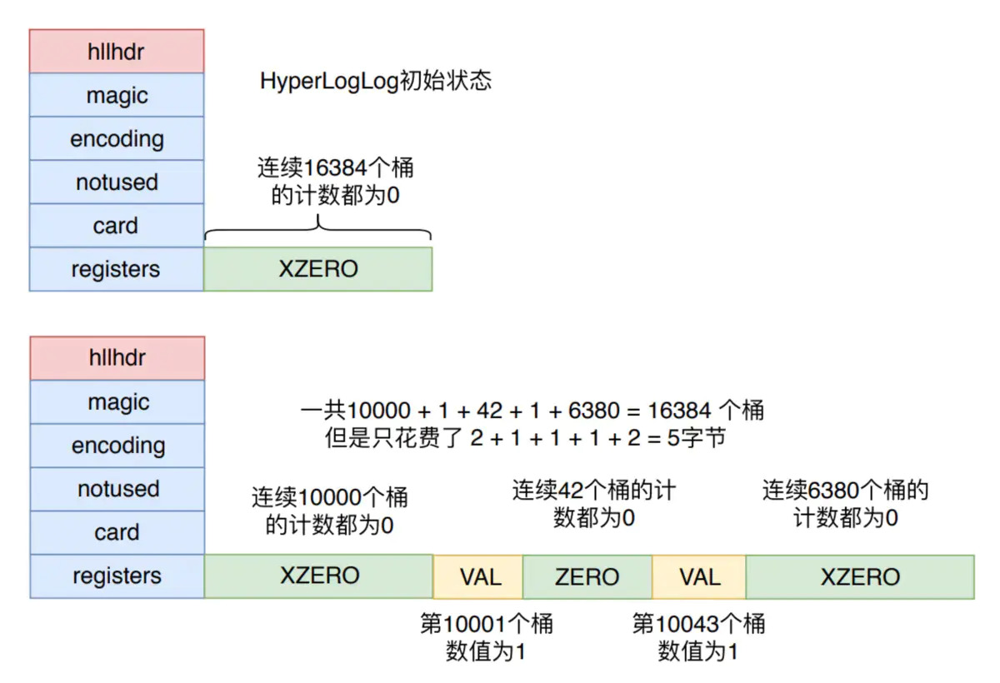

HyperLogLog 是一个求解集的势（即集合中不重复元素个数）的算法，由于是基于统计学的算法，所以结果必然会存在一定的误差。

在抛硬币游戏中（伯努利试验），如果对方说自己最多能够连续抛出反面 2 次，那么我们由此可以推断对方抛硬币的总次数一定不多。如果对方说自己最多能够连续抛出反面 10 次，这时候我们就可以推断对方一定抛了非常多次硬币（除非出现突发事件），这实际就是一个普通的概率问题。但是怎么计算出对方抛硬币的大概次数呢？

我们将每次抛硬币结果记录下来，正面朝上记为 1，反面朝上记为 0，最终得到一个由 0 和 1 组成的序列。比如存在这么一个序列：

```
01 01 0001 00
```

接下来从这个序列中找出 0 出现的连续次数最多的那一段子序列（包括这个序列后面的那个 1），即 0001，简单计算就能得出要出现这个子序列的概率是 1/2 的 4 次幂，即 1/16，这时候我们就可以估计出对方大概抛了 16 次硬币。很显然，这种估算方式存在较大的误差，而且很容易收到突发事件（比如连续抛出了多次反面）的影响，这时候就需要 HyperLogLog 算法来减小这个误差。

如开篇所述，HyperLogLog 的目标是求集的势，而集合中存放的元素又可以是任何类型，那么在实际应用中怎么将这些元素转换为上文示例中的 01 序列呢？答案很简单，先求集合中的每一个元素的 hash 值，然后再将 hash 值转换为二进制，这样就可以将每个集合元素都转换为算法所需要的 01 序列了。接下来的算法过程，我们以 Redis 的实现作为例子进行讲解。

当有新元素放入 Redis 提供的 HyperLogLog 数据结构时：

1. 对元素进行 hash 运算得到一个 64bit 的比特串
2. 将比特串的低 14 位，即右边 14 位拿出来作为桶的编号，则最多会存在 2^14 = 16384 个桶
3. 在剩下的 50 位中找到第一次出现的 1（从低位开始往高位找，即从右往左找），将其下标（下标计数从 1 开始）放入第 2 步算出的编号对应的桶中。如果桶中有数据，则只有在当前下标值大于桶中的值时才放入。

64bit 拿掉低 14 位后还有 50 位，桶里存放的是 50 位中第一次出现的 1 的下标，这就意味着下标最大只能是 50。要存下 50 这个数字只需要 6bit，所以在 Redis 中一个桶只需要占用 6bit 的空间，16384 个桶总共只需要 12kb 的空间，这就是通常所说的一个 Redis HyperLogLog 实例最多只占用 12kb 的依据。这种数据存储模式叫做 **密集存储结构**。

考虑这样一个情况，在一个 Redis HyperLogLog 实例的生命周期里，只有少量的数据会被添加进来，也就是说 16384 个桶中的绝大部分都不会保存数据（桶中的计数默认为 0），这时候也需要直接分配 12kb 的内存来维护这些桶吗？Redis 为了进一步节省内存，采用 **稀疏存储结构** 来进一步优化。

在创建 Redis HyperLogLog 实例时，Redis 不会直接分配 12kb 的空间来维护所有的桶，而是自定义了三条指令来减小空间使用。

1. ZERO 指令。这个指令会占用 1 字节的空间，表示连续多少个桶的计数为 0。高位的 2bit 是标志位，默认是 00，低 6 位用于表示有多少个桶，最大表示 64 个桶。
1. XZERO 指令。这个指令会占用 2 字节的空间，表示连续多少个桶的计数为 0。和 ZERO 指令的区别在于，高位的 2bit 标志位默认是 01，低 14 位用于表示有多少个桶，最大可表示 16384 个桶。
1. VAL 指令。这个指令会占用 1 字节的空间，表示连续多少个桶的计数为 N（N > 0）。高位的 1bit 是标志位，默认值是 1，接下来的 5bit 表示计数 N，低 2 位表示痛的数量，所以最大可表示计数为 32。



如上图所示，在稀疏存储结构模式下，一个 Redis HyperLogLog 实例在初始状态时只需要占用 2 个字节。由于 VAL 指令能够表示的计数最大为 32，所以只要出现 N > 32 的情况，稀疏存储结构就会变成密集存储结构。另外，如果稀疏存储结构的内存占用超过了 3000 字节，也会默认转为密集存储结构，这个阈值可以使用 `hll_sparse_max_bytes` 参数进行调整。

无论是使用稀疏存储结构还是密集存储结构，最终的目的是要计算出这个集合的势。HyperLogLog 算法求解公式如下：

$$
DV_{LL} = c * m * \frac{m}{\sum_{i=1}^m\frac{1}{x_i}}
$$

`m` 是桶的数量，`c` 是常数，由 `m` 来计算得出。首先计算 `m` 以 2 为底的对数：

$$
p = log_2m
$$

然后根据 `p` 的值来选择 `c` 的值（这些值是 HyperLogLog 算法里写明的，此处不再进一步推导）：

```java
switch (p) {
   case 4:
       c = 0.673 * m * m;
   case 5:
       c = 0.697 * m * m;
   case 6:
       c = 0.709 * m * m;
   default:
       c = (0.7213 / (1 + 1.079 / m)) * m * m;
}
```

正如开篇所述，HyperLogLog 是一个基于统计学的算法，其求出的解是必然存在偏差的，所以桶的数量 `m` 决定了最终求出的解的准确度，桶越多，精度越高。这个准确度也称作「相对标准误差」，即 RSD，准确度与桶的数量可以形成如下的关系：

$$
RSD = \frac{1.04}{\sqrt[2]{m}}
$$

在 Redis 对 HyperLogLog 的实现中，预期 RSD 为 0.81%，代入上面的公式：

$$
0.0081 = \frac{1.04}{\sqrt[2]{m}} \\
\sqrt[2]{m} \approx 128 \\
m = 16384
$$

Redis 的 HyperLogLog 使用 16384 个桶的依据就找到了。最后就是对所有的桶求调和平均数，将每个桶保存的数据的倒数相加，与桶数量 `m` 相除即可。

调和平均数的结果会倾向于较小的数，这比直接使用算数平均数可以更少的受到大数的影响。比如计算你和你领导的薪资，你一个月 1000，你领导一个月 100000，算数平均数为 50500，很明显这个结果距离里的薪资差距非常大。但是调和平均数的结果为 1980 元，这就比较接近你的薪资了。

在 Redis 中可以使用 `pfmerge` 命令来合并多个 HyperLogLog 实例，这个合并的过程实际就是在两个实例的相同编号的桶里选择保存的更大的那个数据作为新的 HyperLogLog 实例对应位置的数据。


最后，Redis 中所有操作 HyperLogLog  的命令都是以 `pf` 开头，这是因为 HyperLogLog  算法的作者是法国人 Philippe Flajolet，已于 2011 年 3 月 22 日去世，享年 64 岁。
